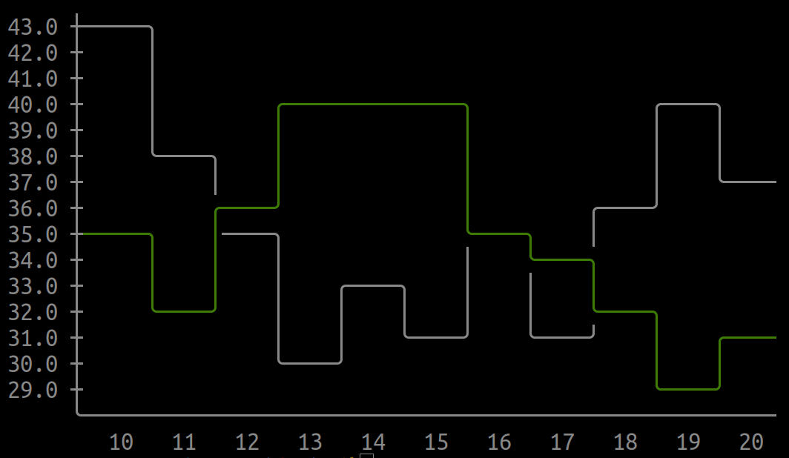
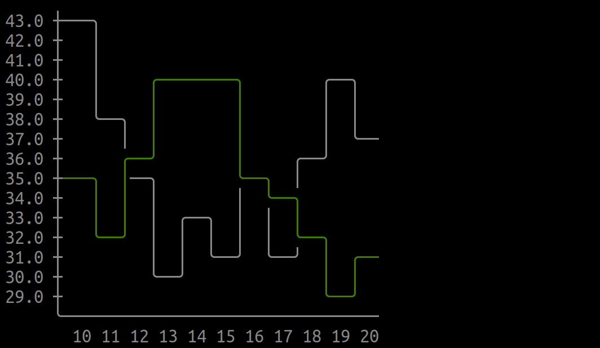

# PY-AsciiGraph

My own implementation of a graph generator using ascii characters.



## Usage:

Use the method ```AsciiGraph.plot```. You can customize the graph following this logic:

```
AsciiGraph.plot(
	plots: list,
	keys: list,
	dy: int = 1,
	dx: int = 1,
	min_value_overlap_axis: bool = False,
	hide_horizontal_axis: bool = True
) -> str:
```

- ```plots```: Array of dictionaries with the values and the color of the plot. Keep in mind that the length of all the values arrays must be the same.
	```python
	plots = [
		{
			'values': [1, 2, ..., n],
			'color': 'color_as_string',
		},
		...
	]
	```

- ```keys```: Array of elements to be used as values for the horizontal axis. Keep in mind that the length of this array must be equal to the length of the values array in each plot.
	```python
	keys = ['1', '2', ..., 'n']
	```

- ```dy```: Separation between values in the vertical axis. Default: 1
- ```dx```: Separation between values in the horizontal axis. Default: 1
- ```min_value_overlap_axis```: If True, the minimum value collides with the horizontal axis. If False, the minimum value is placed above the horizontal axis. Default: False
- ```hide_horizontal_axis```: If True, the horizontal axis is not shown. Default: True



## Note:

Idea taken from the [asciigraph](https://github.com/guptarohit/asciigraph) library.
